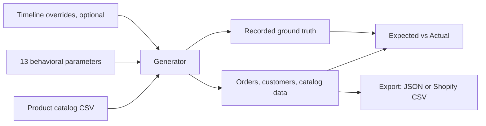

# Shopify Synth

[](./LICENSE)
[](https://shopify-synth-seven.vercel.app)

Generates realistic, seed-reproducible Shopify store data: orders, customers, and catalog activity, calibrated to real D2C behavior. COD-heavy payment splits, return-to-origin risk, discount-driven demand, and festival seasonality are all modeled in, not bolted on.

**[Live demo →](https://shopify-synth-seven.vercel.app)**

<!-- Add a screenshot or short GIF of the app here before publishing.
     A single frame of the Parameters section plus a generated
     Expected vs Actual table sells this faster than any paragraph. -->

---

## Why this exists

Most "fake data" tools for Shopify do one job: make a dev store look populated. That's fine until you need to test something that depends on how the data behaves, not just how much of it there is.

I built this while working on Ekai, an analytics tool for Indian D2C brands. Testing it meant needing datasets where cash-on-delivery orders carry real return risk, where festival weeks spike order volume the way Diwali actually does, and where the same seed produces the same dataset twice, so a bug fixed today doesn't quietly reappear tomorrow because the underlying "random" data shifted.

Nothing on the market did that. So this exists.

---

## What it does

- **Bring your own catalog.** Upload a standard Shopify product export CSV. Generated orders reference real SKUs, prices, and product IDs from it. There is no built-in fake catalog. Real data in, real data out.
- **Thirteen behavioral parameters, grouped and documented.** Volume, customer mix, payments and returns, discounts and basket size. Every field has a plain-language description and a stated valid range.
- **Six scenario presets** as starting points, subscription-heavy retention, discount-driven fashion, COD-heavy with high RTO risk, and more, each just a quick-fill for the parameters above. Click one, then edit anything you like.
- **Timeline overrides.** Paste as many time-windowed overrides as needed, a festival spike here, a slowdown there. Each row touches only the parameters you name; everything else keeps reading from your base settings.
- **Deterministic by seed.** Same seed, same parameters, same catalog, identical output, every run.
- **Validation built in, not assumed.** Every generated dataset ships with an Expected vs Actual comparison, what you asked for against what the generator actually produced, computed from the real per-day values used during generation rather than a re-simulation.
- **Two export formats.** Raw JSON for programmatic use, or a file shaped exactly like Shopify's native order-export CSV, ready to feed into analytics tools that expect that format.
- **Runs entirely in your browser.** Generation, parsing, and export all happen client-side. Nothing you upload ever reaches a server.

---

## How it works



Parameters describe an ordinary day. Overrides describe the days that aren't. The generator resolves both into a per-day target, builds baskets against your catalog's real prices, and records what it actually aimed for alongside what it produced. That's what makes the comparison table meaningful: it isn't measuring the generator against itself with nothing around to catch drift.

Most of what's happening underneath is seeded random sampling and a hand-rolled trend model, plus a couple of statistics problems that turned into real bugs along the way. Wrote that up separately in [`docs/TECHNICAL-NOTES.md`](./docs/TECHNICAL-NOTES.md) if that's the kind of thing you're curious about.

---

## A few product decisions worth reading

This project went through several rounds of "the output looks wrong, why" that turned out to be modeling problems, not bugs. The full writeup, including the ones that didn't make the cut here, is in [`docs/DECISIONS.md`](./docs/DECISIONS.md). Two of the more interesting ones:

**Average order value isn't a real input, so it stopped being treated like one.** Early versions let you type in a target AOV, mean and spread, then forced the generator to hit it: capping unit prices, resampling baskets, rejecting output that overshot. It kept breaking in new ways, and every fix addressed a symptom. The actual issue was upstream: a merchant doesn't set AOV directly, it falls out of what's for sale and how people shop. AOV inputs were replaced with two parameters that genuinely are independent of any catalog, items per order and a multi-unit purchase rate, and AOV became a derived readout instead. The whole class of bug disappeared, because nothing was fighting an externally imposed number anymore.

**Realism took a back seat to accuracy, on purpose.** Most synthetic data tools optimize for looking plausible. This one exists to be ground truth for testing calculations against, so it optimizes for hitting the stated input parameters as closely as the math allows, even when that produces something a human wouldn't call realistic, one product bought far more than the rest, say. A generator that looks slightly more believable but is a few percent off its own stated targets is a worse foundation for a test suite than one that looks odd but is numerically honest.

More decisions, catalog architecture, why overrides layer instead of replacing base parameters, why a comparison table exists at all, are in the full doc.

---

## Quickstart

### Web

Open the [live demo](https://shopify-synth-seven.vercel.app), upload a product catalog (a sample one is linked in the app if you don't have your own), set or quick-fill parameters, and generate.

### CLI

```bash
git clone https://github.com/<your-username>/shopify-synth.git
cd shopify-synth
npm install

npm run generate -- \
  --catalog ./public/sample-catalog.csv \
  --profile bloom \
  --output ./output.json
```

<!-- Fill in the full flag list from your actual CLI, including
     --params, date range flags, and --seed if exposed separately. -->

---

## Tech stack

Next.js (App Router), TypeScript, Tailwind CSS. Generation, parsing, and export all run client-side. No backend, no database, no server-side compute in the loop.

---

## Roadmap

- [ ] Advanced tab for timeline overrides, separating everyday use from power-user configuration
- [ ] Dev-store push via the Shopify GraphQL Admin API, scoped to a bounded sample rather than a full dataset, since trial and development stores are rate-limited to roughly five order creations per minute regardless of API used
- [ ] Additional scenario presets contributed by users

Open an issue if there's a scenario or parameter you'd find useful.

---

## Contributing

Contributions are welcome. See [`CONTRIBUTING.md`](./CONTRIBUTING.md) for how to get set up and what's useful to submit.

---

## Acknowledgments

Set in [Instrument Serif](https://fonts.google.com/specimen/Instrument+Serif), [Instrument Sans](https://fonts.google.com/specimen/Instrument+Sans), and [JetBrains Mono](https://fonts.google.com/specimen/JetBrains+Mono), all released under the SIL Open Font License.

---

## License

MIT. See [`LICENSE`](./LICENSE).

---

Built by [Your Name] · [LinkedIn] · [Portfolio]
